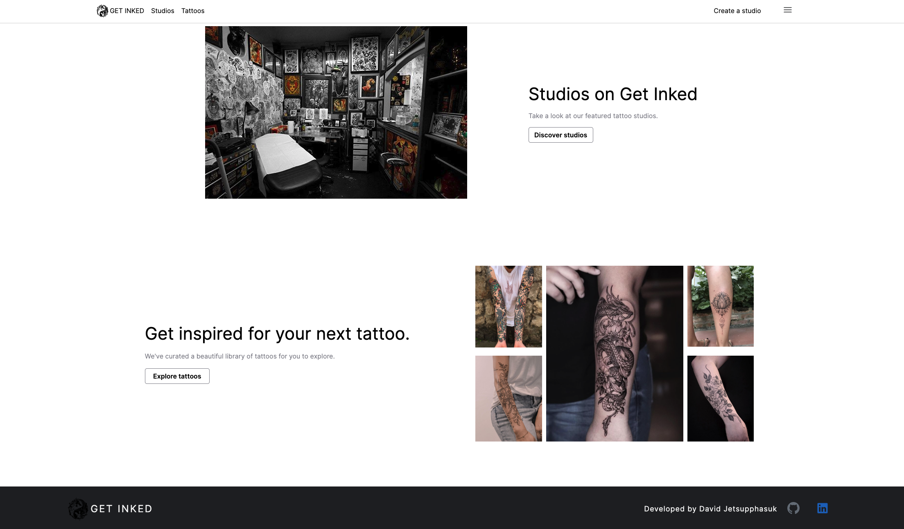
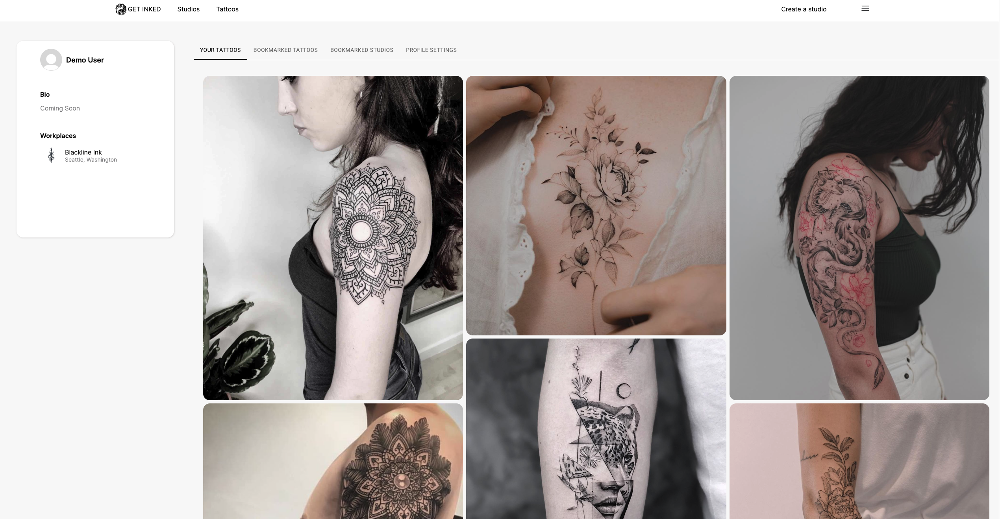

# Welcome to GET INKED

Get Inked is a web app where authenticated users can create or join a tattoo studio and can post images of their work to draw in more clients. Users will be able to view the portfolio of a studio or artist and schedule an appointment for their next art piece on their body.

<h3 align='center'>
 <a target='_blank' href="https://get-inked-app.herokuapp.com">» Check out the live site here «</a>
</h3>

# Technologies Used


# Wiki Links

- [Database Schema](https://github.com/davidjettt/Get-Inked/wiki/Database-Schema)
- [MVP Features](https://github.com/davidjettt/Get-Inked/wiki/MVP-Features)
- [User Stories](https://github.com/davidjettt/Get-Inked/wiki/User-Stories)

# Challenges/Code Sample
```Javascript
      const data = await dispatch(createApptThunk(formData))
      if (data.errors) {
            setErrors(data.errors)
            setLoading(false)
      } else {
            const imageData = new FormData()
            images.forEach(image => imageData.append('ref_images', image))
            const badData = await dispatch(postAppointmentImageThunk(imageData, data.appt.appointment.id))
            if (badData) {
               setErrors(badData)
               setLoading(false)
            }
            else {
               await dispatch(getOneAppointmentThunk(data.appt.appointment.id))
               history.push(`/studios/${studio.id}`)
            }
      }
```
A feature I wanted to implement in this project was giving the user the ability to upload image files from their computer. I also wanted to learn cloud services and thought AWS S3 would be a great start. This is a code snippet from a function in a React/Redux application that gets triggered when a user submits an appointment form that contains both text and multiple image file inputs. There were a few things that made implementing this feature challenging. One, since SQLite, the database I was using in development, doesn't support arrays as a datatype, I am unable to store multiple image URL strings for a single appointment. What I had to do instead was to create another table that holds images with a foreign key to the appointments table. Second, since the images need a foreign key and this feature is a POST feature, I need to first create the entry in the database for the appointment before adding the images to the database.

So what the code snippet is doing is that `dispatch` gets called with all the form data, triggering a fetch call and state change. If the data sent back contains an error, an error message will appear. But, if all is well, then an appointment entry will be created and saved in the database. A second fetch call will be called on all the images the user has uploaded and stored in an AWS S3 bucket and a special URL string to the image will be saved in the database with the appointment id of the recently created appointment as the foreign key. Again if an error gets sent back from the second dispatch call then it will be displayed on the client. Lastly, a final dispatch call is used get the newly created image with all the images associated with it and update the Redux store.

This was challenging, but this is what I am also proud of.

TO DO
- Try to see if can just query for the appointment after saved images to database in appointment API route

# Application Images

## Splash/Landing Page


## Home Page


<!-- # Home Page (bottom)

 -->

## User Profile



## Appointment Form


## Studio Form


## Tattoos Page


## Single Tattoo


<!-- ## Getting started

1. Clone this repository (only this branch)

   HTTPS:

   ```bash
   git clone https://github.com/davidjettt/Get-Inked.git
   ```

   SSH:

   ```bash
   git clone git@github.com:davidjettt/Get-Inked.git
   ```

2. Install dependencies

   ```bash
   pipenv install -r requirements.txt
   ```

3. Create a **.env** file based on the example with proper settings for your
   development environment
4. Make sure the SQLite3 database connection URL is in the **.env** file

5. Get into your pipenv, migrate your database, seed your database, and run your Flask app

   ```bash
   pipenv shell
   ```

   ```bash
   flask db upgrade
   ```

   ```bash
   flask seed all
   ```

   ```bash
   flask run
   ```

6. To run the React App in development, checkout the [README](./react-app/README.md) inside the `react-app` directory.

<br> -->

<!-- ## Deploy to Heroku
This repo comes configured with Github Actions. When you push to your main branch, Github will automatically pull your code, package and push it to Heroku, and then release the new image and run db migrations.

1. Write your Dockerfile. In order for the Github action to work effectively, it must have a configured Dockerfile. Follow the comments found in this [Dockerfile](./Dockerfile) to write your own!

2. Create a new project on Heroku.

3. Under Resources click "Find more add-ons" and add the add on called "Heroku Postgres".

4. Configure production environment variables. In your Heroku app settings -> config variables you should have two environment variables set:

   |    Key          |    Value    |
   | -------------   | ----------- |
   | `DATABASE_URL`  | Autogenerated when adding postgres to Heroku app |
   | `SECRET_KEY`    | Random string full of entropy |

5. Generate a Heroku OAuth token for your Github Action. To do so, log in to Heroku via your command line with `heroku login`. Once you are logged in, run `heroku authorizations:create`. Copy the GUID value for the Token key.

6. In your Github Actions Secrets you should have two environment variables set. You can set these variables via your Github repository settings -> secrets -> actions. Click "New respository secret" to create
each of the following variables:

   |    Key            |    Value    |
   | -------------     | ----------- |
   | `HEROKU_API_KEY`  | Heroku Oauth Token (from step 6)|
   | `HEROKU_APP_NAME` | Heroku app name    |

7. Push to your `main` branch! This will trigger the Github Action to build your Docker image and deploy your application to the Heroku container registry. Please note that the Github Action will automatically upgrade your production database with `flask db upgrade`. However, it will *not* automatically seed your database. You must manually seed your production database if/when you so choose (see step 8).

8. *Attention!* Please run this command *only if you wish to seed your production database*: `heroku run -a HEROKU_APP_NAME flask seed all`

## Helpful commands
|    Command            |    Purpose    |
| -------------         | ------------- |
| `pipenv shell`        | Open your terminal in the virtual environment and be able to run flask commands without a prefix |
| `pipenv run`          | Run a command from the context of the virtual environment without actually entering into it. You can use this as a prefix for flask commands  |
| `flask db upgrade`    | Check in with the database and run any needed migrations  |
| `flask db downgrade`  | Check in with the database and revert any needed migrations  |
| `flask seed all`      | Just a helpful syntax to run queries against the db to seed data. See the **app/seeds** folder for reference and more details |
| `heroku login -i`      | Authenticate your heroku-cli using the command line. Drop the -i to authenticate via the browser |
| `heroku authorizations:create` | Once authenticated, use this to generate an Oauth token |
| `heroku run -a <app name>` | Run a command from within the deployed container on Heroku | -->
